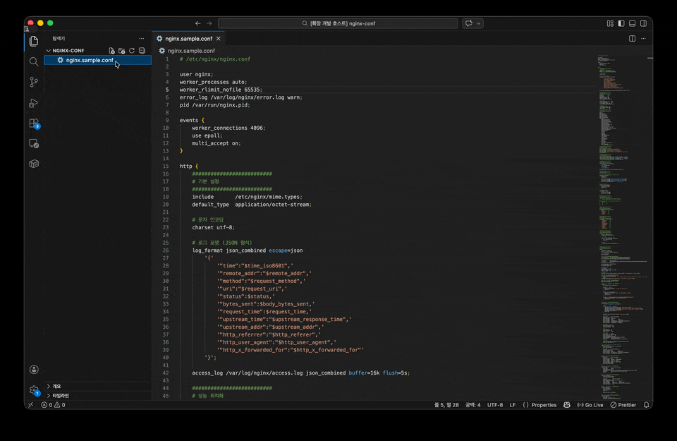

# Nginx Config Viewer

Visualize and analyze your `nginx.conf` files directly inside VS Code — without leaving the editor.

## Features

- **Formatted View** — Syntax-highlighted config with line numbers and indentation controls
- **Tree** — Hierarchical block explorer; click any node to jump to its source line
- **Summary** — Virtual host cards per server block with directive tooltips
- **Locations** — Location block priority analysis, global URL match testing, and search
- **Diagram** — Visual map of server → upstream connections (`proxy_pass`, `alias`, `upstream`)

## Usage

Right-click any `.conf` file or a file named `nginx*` in the Explorer or editor, then select **Open in Nginx Viewer**.

The viewer opens in a full-screen panel and automatically loads the file content.

## Supported Files

- `*.conf`
- Files with `nginx` in the filename (e.g. `nginx.conf`, `nginx.prod.conf`)

## Requirements

VS Code `1.85.0` or later.

## License

MIT

---

VS Code 안에서 `nginx.conf` 파일을 바로 시각화하고 분석할 수 있는 확장프로그램 입니다.

## 기능

- **Formatted** — 구문 하이라이팅 및 줄 번호, 들여쓰기 옵션 제공
- **Tree** — 블록 계층 구조 탐색; 노드 클릭 시 해당 소스 라인으로 이동
- **Summary** — 서버 블록별 Virtual Host 카드, directive 툴팁
- **Locations** — location 우선순위 분석, 전역 URL 매칭 테스트 및 검색
- **Diagram** — 서버 → 백엔드 연결 시각화 (`proxy_pass`, `alias`, `upstream`)

## 사용 방법

탐색기 또는 에디터에서 `.conf` 파일이나 `nginx`가 포함된 파일명을 우클릭한 후 **Open in Nginx Viewer** 를 선택하세요.

뷰어가 전체 화면 패널로 열리며 파일 내용을 자동으로 불러옵니다.

## 지원 파일

- `*.conf`
- 파일명에 `nginx`가 포함된 파일 (예: `nginx.conf`, `nginx.prod.conf`)

## 요구 사항

VS Code `1.85.0` 이상
